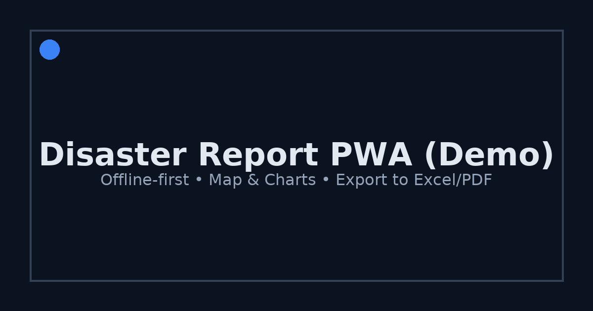

# Disaster Report PWA (Demo)

PWA untuk pelaporan dampak bencana dari tingkat desa/kecamatan hingga rekap admin. Mendukung **offline-first**, **GPS/peta**, dan **ekspor**.


[](LICENSE)

## ✨ Fitur
- 🧭 Lokasi: GPS otomatis atau pilih titik peta (Leaflet).
- 🗺️ Peta interaktif: marker berwarna per jenis + popup detail.
- 📊 Dashboard: Bar (jumlah per jenis) & Pie (RB/RS/RR).
- 🔌 Offline-first: IndexedDB + auto sync saat online.
- 👥 Role demo: Desa / Kecamatan / Admin.
- 📤 Ekspor: Excel & PDF.
- 📱 PWA: bisa di-install.

## 🧱 Stack
React • TypeScript • Vite • Dexie (IndexedDB) • React-Leaflet • Recharts • Vercel

## 🚀 Jalankan Lokal
```bash
npm i    # atau yarn / pnpm
npm run dev
# disaster-report-pwa
